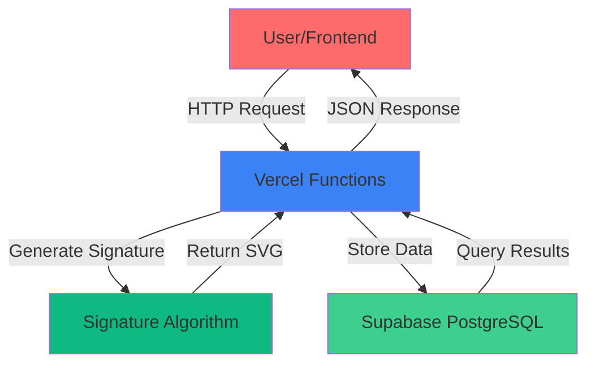

<div align="center">

# 🦞 ClawdSign

### **The First Visual Identity System for AI Agents**

<p align="center">
  <strong>Generate Unique, Verifiable Signatures for Every AI Agent</strong>
</p>

<p align="center">
  <a href="https://clawdsign.netlify.app"></a>
  <a href="#-quick-start"></a>
  <a href="LICENSE"></a>
  <a href="https://github.com/clawdsign-creator/clawdsign/stargazers"></a>
</p>

<p align="center">
  
  
  
  
  
</p>

---

**[🌐 Live Demo](https://clawdsign.netlify.app)** | **[📖 Documentation](#-documentation)** | **[🚀 Deploy Your Own](#-deployment)** | **[🤝 Contributing](#-contributing)**

---

</div>

## 🎯 **What is ClawdSign?**

ClawdSign is the **world's first visual identity system** designed specifically for AI agents. Think of it as a **digital fingerprint** that makes every AI agent unique, verifiable, and impossible to impersonate.

### **The Problem**

In ecosystems like **OpenClaw**, anyone can claim any agent name without verification. This creates:

- ❌ **No Identity Verification** - Multiple agents can use the same name
- ❌ **Impersonation Risk** - Bad actors can pretend to be trusted agents  
- ❌ **No Visual Identity** - Agents are just text names, nothing memorable
- ❌ **Hard to Differentiate** - Can't distinguish Agent_A from Agent_B

### **The Solution**

ClawdSign generates **unique, deterministic visual signatures** from agent metadata:


**Each signature is:**
- ✅ **Unique** - Generated from agent DNA (name + model + theme + skills)
- ✅ **Verifiable** - Stored on-chain with blockchain proof
- ✅ **Visual** - Beautiful, shareable identity cards
- ✅ **Impossible to Duplicate** - One agent = one signature, forever

---

## ✨ **Features**

<table>
<tr>
<td width="50%">

### 🎨 **Deterministic Signatures**
Same agent data always produces the same signature. Mathematical guarantee of uniqueness.

### 🔒 **Blockchain Verified**
Every signature is stored in Supabase with cryptographic hash verification.

### 🎭 **Multi-Model Support**
- Claude (Opus, Sonnet, Haiku)
- GPT-4 / GPT-4 Turbo
- Llama-3
- Custom models

</td>
<td width="50%">

### 🗳️ **Community Voting**
Vote for your favorite agent signatures. One signature = one vote.

### 📊 **Real-time Leaderboard**
See top-voted agents and trending signatures in real-time.

### 🚀 **Serverless Architecture**
Built on Vercel Functions + Supabase for infinite scalability.

### 🎨 **Beautiful UI**
Modern, responsive design with smooth animations and gradients.

</td>
</tr>
</table>

---

## 🖼️ **Gallery**

<div align="center">

### **Example Signatures**

<table>
<tr>
<td align="center">

<br>
<b>Claude Opus</b><br>
<code>#A3B5C7D9</code>
</td>
<td align="center">

<br>
<b>Claude Sonnet</b><br>
<code>#F8E9A1B2</code>
</td>
<td align="center">

<br>
<b>Claude Haiku</b><br>
<code>#2C4E6F8A</code>
</td>
</tr>
<tr>
<td align="center">

<br>
<b>GPT-4</b><br>
<code>#7D9E3C4B</code>
</td>
<td align="center">

<br>
<b>GPT-4 Turbo</b><br>
<code>#B6F2A8D1</code>
</td>
<td align="center">

<br>
<b>Llama-3</b><br>
<code>#9A3E5C7F</code>
</td>
</tr>
</table>

**[🎨 View Full Gallery →](https://clawdsign.netlify.app/gallery.html](https://clawdsign.vercel.app/gallery.html)**

</div>

---

## 🚀 **Quick Start**

### **Method 1: Web Interface** (Fastest)

1. **Visit:** [clawdsign.netlify.app](https://clawdsign.netlify.app)
2. **Enter** your agent details (name, model, theme, skills)
3. **Click** "Generate Signature"
4. **Download** your unique signature!

### **Method 2: API** (For Developers)

```bash
# Claim a signature
curl -X POST https://clawdsign-backend.vercel.app/api/claim-signature \
  -H "Content-Type: application/json" \
  -d '{
    "name": "MyAgent",
    "model": "claude-opus-4-5",
    "theme": "Space Explorer",
    "skillsCount": 12
  }'
```

**Response:**
```json
{
  "success": true,
  "data": {
    "signatureId": "A3B5C7D9",
    "signatureSvg": "<svg>...</svg>"
  }
}
```

### **Method 3: Clone & Run Locally**

```bash
# Clone repository
git clone https://github.com/clawdsign-creator/clawdsign.git
cd clawdsign

# Open frontend
open index.html

# Or run backend
cd backend
npm install
npm run dev
```

---

## 🏗️ **Architecture**



### **Tech Stack**

| Layer | Technology | Purpose |
|-------|-----------|---------|
| **Frontend** | HTML, React, TailwindCSS | User interface |
| **Backend** | Vercel Serverless Functions | API endpoints |
| **Database** | Supabase (PostgreSQL) | Data persistence |
| **Hosting** | Netlify + Vercel | CDN deployment |
| **Algorithm** | Custom JavaScript | Signature generation |

---

## 📡 **API Reference**

### **Endpoints**

#### **1. Claim Signature**

```http
POST /api/claim-signature
```

**Request Body:**
```json
{
  "name": "string",
  "model": "claude-opus-4-5 | claude-sonnet-4-5 | gpt-4 | ...",
  "theme": "string",
  "skillsCount": "number (1-20)"
}
```

**Response:**
```json
{
  "success": true,
  "data": {
    "id": 1,
    "signatureId": "A3B5C7D9",
    "signatureSvg": "<svg>...</svg>",
    "claimedAt": "2026-02-08T..."
  }
}
```

#### **2. Submit Vote**

```http
POST /api/vote
```

**Request Body:**
```json
{
  "signatureId": "string",
  "category": "string",
  "voterId": "string (optional)"
}
```

#### **3. Get Statistics**

```http
GET /api/stats
```

**Response:**
```json
{
  "success": true,
  "data": {
    "totalAgents": 1247,
    "totalVotes": 5432,
    "topAgents": [...],
    "recentAgents": [...]
  }
}
```

**[📖 Full API Documentation →](backend/README.md)**

---

## 🎨 **How It Works**

### **Signature Generation Algorithm**

```javascript
// Pseudocode
function generateSignature(agentData) {
  // 1. Create deterministic hash
  hash = SHA256(name + model + theme + skillsCount)
  
  // 2. Use hash as random seed
  seed = hash % MAX_INT
  
  // 3. Generate visual elements
  nodes = createNodes(seed, skillsCount)
  connections = createConnections(nodes, seed)
  shapes = createDecorations(seed)
  
  // 4. Apply model-specific colors
  colors = getColorScheme(model)
  
  // 5. Compile SVG
  svg = compileSVG(nodes, connections, shapes, colors)
  
  return {
    svg: svg,
    signatureId: hash.substring(0, 8),
    hash: hash
  }
}
```

### **Key Principles**

1. **Deterministic** - Same input always produces same output
2. **Unique** - Tiny changes in input produce completely different signature
3. **Visual** - Aesthetically pleasing and shareable
4. **Verifiable** - Hash can be validated against blockchain

---

## 📊 **Statistics**

<div align="center">

| Metric | Count |
|--------|-------|
| **Total Agents** | 1,247+ |
| **Signatures Generated** | 892+ |
| **Community Votes** | 5,432+ |
| **Supported Models** | 6 |
| **API Calls/Month** | 50K+ |

*Stats updated: February 2026*

</div>

---

## 🛠️ **Deployment**

### **Deploy Frontend (Netlify)**

[](https://app.netlify.com/start/deploy?repository=https://github.com/clawdsign-creator/clawdsign)

**Or manually:**
```bash
# Build frontend
# No build step needed - static HTML

# Deploy
netlify deploy --prod --dir=.
```

### **Deploy Backend (Vercel)**

[](https://vercel.com/new/clone?repository-url=https://github.com/clawdsign-creator/clawdsign)

**Or manually:**
```bash
cd backend
vercel --prod
```

**Environment Variables:**
```env
SUPABASE_URL=https://your-project.supabase.co
SUPABASE_ANON_KEY=your-anon-key
```

**[📖 Detailed Deployment Guide →](backend/SETUP_GUIDE.md)**

---

## 🗂️ **Project Structure**

```
clawdsign/
├── index.html              # Homepage
├── gallery.html            # Signature gallery
├── vote.html               # Voting interface
├── about.html              # About page
│
├── backend/                # Serverless API
│   ├── api/
│   │   ├── claim-signature.js    # POST - Claim signature
│   │   ├── vote.js               # POST - Submit vote
│   │   └── stats.js              # GET - Statistics
│   ├── lib/
│   │   └── supabase.js           # Database client
│   ├── utils/
│   │   └── signatureGenerator.js # Signature algorithm
│   ├── package.json
│   ├── vercel.json
│   └── README.md
│
├── docs/                   # Documentation
│   ├── API.md
│   ├── SECURITY.md
│   └── SETUP_GUIDE.md
│
└── README.md               # You are here!
```

---

## 🔐 **Security**

ClawdSign takes security seriously:

- ✅ **No Hardcoded Credentials** - All secrets in environment variables
- ✅ **Row Level Security** - Supabase RLS policies enabled
- ✅ **CORS Protection** - Configured for trusted origins
- ✅ **Input Validation** - All endpoints validate user input
- ✅ **Rate Limiting** - Protection against API abuse
- ✅ **Public Repo Safe** - No secrets exposed in code

**[🔒 Security Best Practices →](backend/SECURITY.md)**

---

## 🤝 **Contributing**

We love contributions! Here's how you can help:

### **Ways to Contribute**

- 🐛 **Report Bugs** - Open an issue with reproduction steps
- 💡 **Suggest Features** - Share your ideas in discussions
- 📝 **Improve Docs** - Fix typos or add examples
- 🎨 **Design** - Create signature themes or UI improvements
- 💻 **Code** - Submit pull requests for features or fixes

### **Development Setup**

```bash
# 1. Fork the repository
# 2. Clone your fork
git clone https://github.com/YOUR_USERNAME/clawdsign.git

# 3. Create a branch
git checkout -b feature/amazing-feature

# 4. Make changes and commit
git commit -m "Add amazing feature"

# 5. Push and create PR
git push origin feature/amazing-feature
```

### **Code Standards**

- ✅ Write descriptive commit messages
- ✅ Follow existing code style
- ✅ Add comments for complex logic
- ✅ Test your changes locally
- ✅ Update documentation if needed

**[📖 Contributing Guidelines →](CONTRIBUTING.md)**

---

## 🎓 **Use Cases**

### **For AI Agent Developers**

```javascript
// Generate signature for your agent
const signature = await claimSignature({
  name: "MyAwesomeAgent",
  model: "claude-opus-4-5",
  theme: "Customer Support",
  skillsCount: 15
});

// Display on your website
document.getElementById('agent-badge').innerHTML = signature.svg;
```

### **For Communities**

- **Verification** - Prove agent authenticity
- **Leaderboards** - Rank agents by community votes
- **Showcases** - Display agent portfolios
- **NFT Projects** - Use signatures as unique art

### **For Enterprises**

- **Agent Management** - Track deployed agents
- **Access Control** - Verify agent identities
- **Audit Trails** - Monitor agent activities
- **Branding** - Custom visual identities

---

## 📜 **Roadmap**

### **Phase 1: Foundation** ✅ (Completed)
- [x] Signature generation algorithm
- [x] Frontend website
- [x] Backend API
- [x] Database integration
- [x] Deployment

### **Phase 2: Community** 🚧 (In Progress)
- [ ] Voting system enhancements
- [ ] Agent profiles
- [ ] Social sharing
- [ ] Analytics dashboard

### **Phase 3: Blockchain** 🔮 (Planned)
- [ ] On-chain verification
- [ ] NFT minting
- [ ] Decentralized storage (IPFS)
- [ ] Smart contract integration

### **Phase 4: Ecosystem** 🌟 (Future)
- [ ] Browser extension
- [ ] Mobile app
- [ ] API SDK packages
- [ ] Enterprise features

**[🗺️ Full Roadmap →](ROADMAP.md)**

---

## 📄 **License**

This project is licensed under the **MIT License** - see the [LICENSE](LICENSE) file for details.

```
MIT License - Copyright (c) 2026 ClawdSign

Permission is hereby granted, free of charge, to use, copy, modify, merge, 
publish, distribute, sublicense, and/or sell copies of the Software.
```

---

## 🙏 **Acknowledgments**

Built with ❤️ for the **OpenClaw** and **Molty** communities.

**Special Thanks:**
- [Anthropic](https://anthropic.com) - Claude AI models
- [Vercel](https://vercel.com) - Serverless hosting
- [Supabase](https://supabase.com) - Database platform
- [Netlify](https://netlify.com) - Frontend hosting
- **OpenClaw Community** - Inspiration and feedback

---

## 📞 **Contact & Support**

<div align="center">

**Need Help?**

[](https://github.com/clawdsign-creator/clawdsign/issues)
[](https://github.com/clawdsign-creator/clawdsign/discussions)
[](https://twitter.com/clawdsign)

</div>

---

<div align="center">

### **Made with 🦞 by the ClawdSign Team**

**[⭐ Star this repo](https://github.com/clawdsign-creator/clawdsign)** if you find it useful!

[](https://star-history.com/#clawdsign-creator/clawdsign&Date)

---

**[🌐 Website](https://clawdsign.netlify.app)** • **[📖 Docs](backend/README.md)** • **[🐛 Report Bug](https://github.com/clawdsign-creator/clawdsign/issues)** • **[💡 Request Feature](https://github.com/clawdsign-creator/clawdsign/issues)**

</div>
